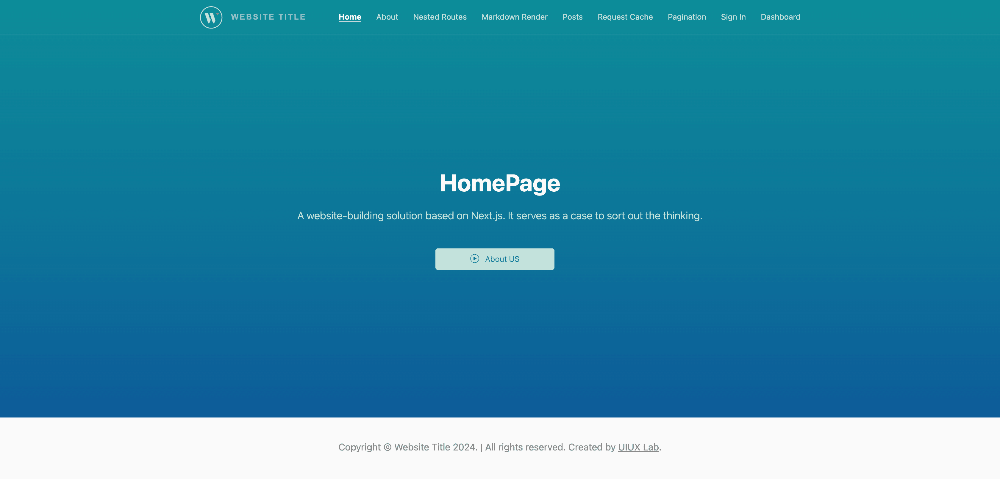

# Full-Stack Next.js Application Template

 This repository is a full-stack sample web application based on Next.js that creates a simple whole-website architecture, and provides the foundational services, components, and plumbing needed to get a basic web application up and running. 





## Table of Contents

* [Scheme](#scheme)
* [File Structures](#file-structures)
* [Getting Started](#getting-started)
* [Further Help](#further-help)
*  - [(💎 Incremental Guide) Migrating from Pages Router to App Router](#---incremental-guide-migrating-from-pages-router-to-app-router)
*  - [Deploy on Custom Server](#--deploy-on-custom-server)
*  - [Deploy on Custom Server](#--deploy-on-custom-server)
*  - [Node.js Port 3000 already in use but it actually isn't?](#--nodejs-port-3000-already-in-use-but-it-actually-isnt)
*  - [Change the Favicon](#--change-the-favicon)
*  - [Customize Menu](#--customize-menu)
*  - [Set port in next.js](#--set-port-in-nextjs)
*  - [Set basePath for a static exported](#--set-basepath-for-a-static-exported)
*  - [Site URL (Root Directory) Configurations](#--site-url-root-directory-configurations)
*  - [Deploy Using Docker (build a single next.js program image)](#--deploy-using-docker-build-a-single-nextjs-program-image)
*  - [Deploy Using Docker (Build composite image that include other custom images)](#--deploy-using-docker-build-composite-image-that-include-other-custom-images)
*  - [Deploy Using Docker (Common Load-balancing Solutions of Socket.io Issue)](#--deploy-using-docker-common-load-balancing-solutions-of-socketio-issue)
*  - [Installation Error or Unable To Run](#--installation-error-or-unable-to-run)
* [Contributing](#contributing)
* [Supported development environment](#supported-development-environment)
* [Changelog](#changelog)
* [Licensing](#licensing)


## Scheme

List my progress here:


| Function Block |  Supports  |
| --- | --- |
| 💎 Pages Router Demo Template | ✅  👉🏼 Enabling it requires renaming the folder [@pages](@pages) to `pages`, and deleting [app](app). |
| 💎 App Router Demo Template | ✅ 👉🏼 Default |
| 💎 Exporting Pure HTML Static Files (**.html**) | ✅  👉🏼 run `npm run export` and `npm run export:fix`|
| HTTP Navigation (SSR & Async) | ✅ |
| Multiple API Constructs | ✅ |
| Parameter Acquisition | ✅ |
| Pagination | ✅ |
| Basic Importing Methods for Components | ✅ |
| Authorization | ✅ |
| Login | ✅ |
| Network Requests | ✅ |
| API Demo | ✅ |
| CURD Demo | ✅ |
| JWT Demo | ✅ |
| File Import | ✅ |
| SEO Premium | ✅ |
| Static Pages | ✅ |
| Incremental Static Regeneration | ✅ |
| Remote Download | ✅ |
| Fully Static HTML Files Generation | ✅ |
| Custom Server | ✅ |
| Custom Hooks (auth, redux, draggable, keypress etc.) | ✅ |
| Frontend Page Interacts With Node | ✅ |
| Alias Support | ✅ |
| Local PHP Service Association | ✅ |
| Server Deployment | ✅ |
| Deploy Using Docker | ✅ |
| Redux Supplement (for navigation) | ✅ |
| Redux SSR (for homepage navigation) | ✅ |
| WebSocket Support via `socket.io` | ✅ |
| Additional Node.js Services | ✅ |
| Request Cache Demo | ✅ |
| Authentication of Microservices | ✅ |
| Markdown Render Demo | ✅ |
| NestJS Support | 🕒 |


## File Structures


```sh
Nextjs-app-template/
├── README.md
├── CHANGELOG.md
├── LICENSE
├── next.config.js
├── server.js
├── ecosystem.config.js
├── middleware.ts
├── tsconfig.json
├── package-lock.json
├── package.json 
├── .dockerignore
├── Dockerfile
├── docker-compose.yml
├── out/                # Folder generated by export command which contains the HTML/CSS/JS assets for your application
├── backend/            
│   ├── server-php.js   # test server
│   └── ...             # All other files are optional
├── scripts/            # Node Script Library
├── public/             # Contains static resources, PHP remote test files, .md files for markdown rendering, etc.
├── app/                # App Router Demo Template
├── @pages/             # Pages Router Demo Template (Enabling it requires renaming the folder `@pages` to `pages`, and deleting `app`.)
│   ├── api/
│   └── *.tsx
├── src/
│   ├── config/
│   ├── data/
│   ├── contexts/
│   ├── interfaces/
│   ├── components/
│   ├── styles/
│   ├── utils/
│   └── store/
└──
```


## Getting Started

Make sure if NODEJS is installed on your computer.

### Install  Dependencies:

```sh
$ npm install
```
It will create `node_module` folder in this all dependency files will be install with this command.

### Update Next.js:

```sh
$ npm i next@latest react@latest react-dom@latest eslint-config-next@latest
```

check out [here](https://nextjs.org/docs/pages/building-your-application/upgrading)


### Run Project in development mode:

```sh
$ npm run dev
```
With is command file will be compiled and it will be loaded on local server [http://localhost:3000](http://localhost:3000).


### Production Build :

```sh
$ npm run build 
```
**Note:** Defer generating all pages on-demand by this command. You can have faster builds by generating all pages on-demand for previews (but not production builds). This is helpful for sites with hundreds/thousands of static pages.


```sh
$ npm run build:static 
```
This build mode will generate static data.


### Start a Next.js production server:

```sh
$ npm run start
```


### Start the PHP server independently:

Please install php on your computer first.

```sh
$ npm run action:phpserver
```
Please use a PHP server environment with a local port of 4000, check the file at `./backend/server-php.js`


### Deploy node server on hosting server:

**production mode:**
```sh
$ npm run build  # this command must be run first
$ npm run deploy:prod 
```

**development mode:**
```sh
$ npm run deploy:dev 
```

*(If it doesn't work because of Node permission, use the following [commands](#deploy-on-custom-server-commands))*

### Stop the existing deployments
```sh
$ npm run destroy
```


### Export your Next.js application to static HTML


FIrst, you need to enable [Static Exports](https://nextjs.org/docs/pages/building-your-application/deploying/static-exports).


> [!WARNING]
> [ISR](https://nextjs.org/docs/pages/building-your-application/rendering/incremental-static-regeneration) cannot be used with "output: export". 


**Step 1. generate static resources:**
```sh
$ npm run export
```

**Step 2. fix name for HTML files:**
```sh
$ npm run export:fix
```

**Step 3. preview the static site**

Then, test the generated static website (the HTML static website is located in the directory `.out/`). Access using the URL [http://localhost:12345](http://localhost:12345)

```sh
$ npm run export:test
```


